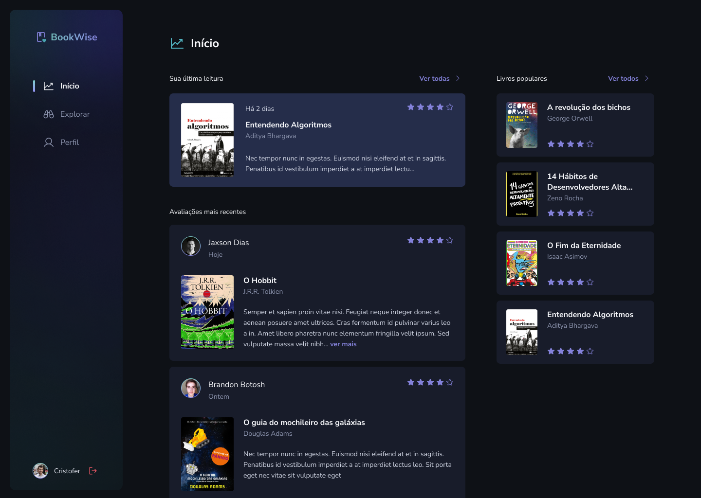
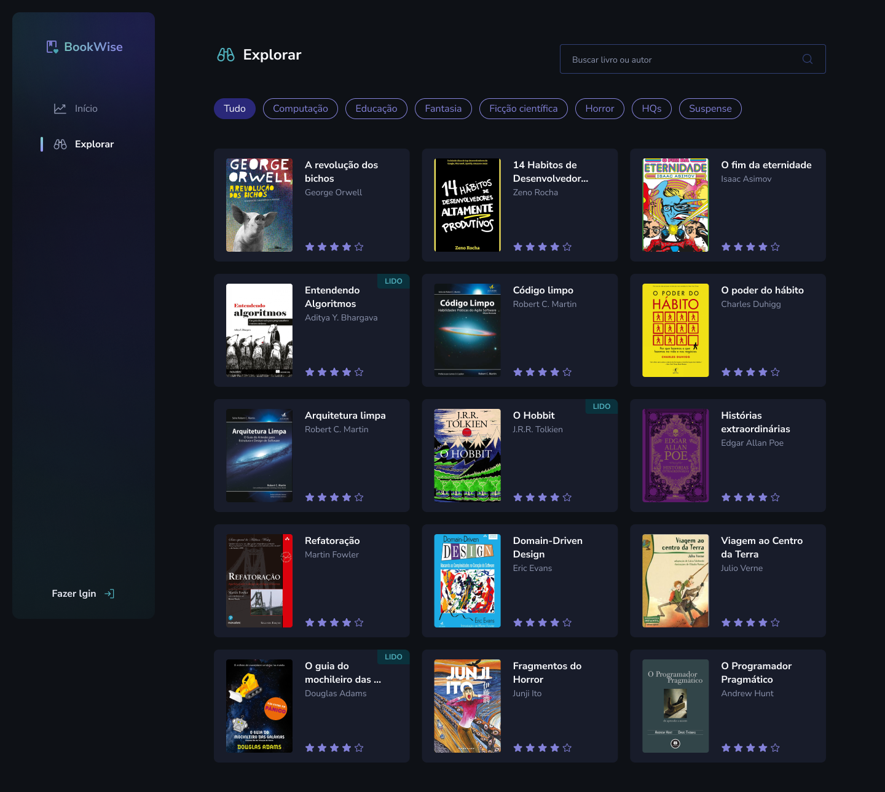

<h1 align="center">

Book-wise :rocket:


</h1>

<p align="center">
  BookWise - Evaluation of books
  <br>
  <br>

  <a href="www.linkedin.com/in/rhalfoliveira">
    
  </a>
  <a href="https://github.com/qwwerty/Book-wise/commits/master">
    
  </a>

</p>

<p align="center">
  <a href="#dart-sobre">About</a> &#xa0; | &#xa0; 
  <a href="#rocket-tecnologias">Technologies</a> &#xa0; | &#xa0;
  <a href="#white_check_mark-requerimentos">Requirements</a> &#xa0; | &#xa0;
  <a href="#checkered_flag-começando">Starting</a> &#xa0; &#xa0; | &#xa0;
  <a href="#framed_picture-imagens">Images</a> &#xa0; &#xa0;
</p>

<br>

## :dart: About

Book-wise is a platform for book reviews on different topics. The aim is to group the opinions of all readers so that someone else can choose a book to read based on existing comments or by star rating.

## :rocket: Technologies

The following technologies were used in the project:

- [Vite](https://vitejs.dev/)
- [NextJs](https://nextjs.org/)
- [Typescript](https://www.typescriptlang.org/)
- [Axios](https://axios-http.com/)
- [Stitches](https://stitches.dev/)
- [Prisma](https://www.prisma.io/)
- [Radix-ui](https://www.radix-ui.com/)
- [Tanstack](https://tanstack.com/)
- [Moment](https://momentjs.com/)
- [Next-auth](https://next-auth.js.org/)
- [Phosphor-react](https://phosphoricons.com/)
- [React-hook-form](https://react-hook-form.com/)
- [React-toastify](https://fkhadra.github.io/react-toastify/introduction)
- [Zod](https://zod.dev/)

## :white_check_mark: Requirements

- [Node](https://nodejs.org/en/)
- [Npm](https://www.npmjs.com/)
- [Yarn](https://yarnpkg.com/lang/en/)

## :checkered_flag: Starting

```bash
# Clone this project
$ git clone https://github.com/qwwerty/Book-wise

# Access
$ cd Book-wise

# Install dependencies
$ npm install

# Create database
$ npx prisma migrate dev

# Inicialize the seed
$ npx prisma db seed

# Rename the .env.example file to .env and configure environment variables 

# Run the project
$ npm run dev

# The server will initialize in the <http://localhost:3000>
```

## :point_right: Figma

- [Figma](<https://www.figma.com/file/Kc8HVxwGUB0BrApZrPY6jk/Ignite-Shop-2.0-(Copy)?node-id=0%3A1&t=scE5guMtOlnqQvnf-1](https://www.figma.com/file/fdbvdiEk8XKiKIZ3EJTyJ3/BookWise-(Copy)?type=design&node-id=1%3A17&mode=design&t=z9rNSJP2AEZ4V7Wg-1>)

## :framed_picture: Images

<h1 align="center">
    
    
    
    
    
    
    
    
    
    
    
</h1>
